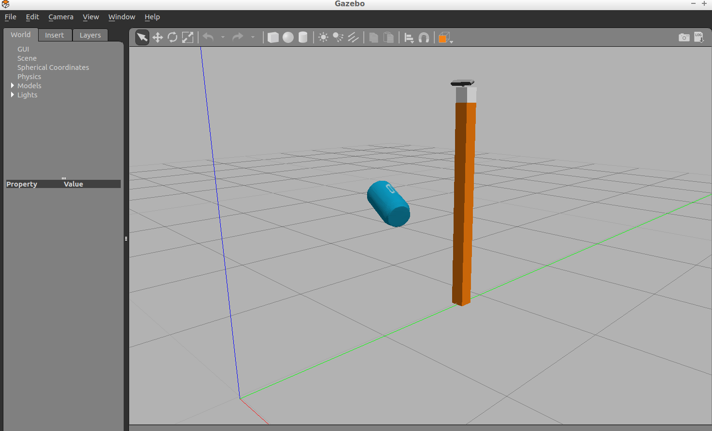

# PCL

## Depth map amd depth cameras :camera:
**Depth cameras** are cameras which give back depth data its better then stereo camera retup as it has a higer realibity and is better then lidar as its more cost-effective. RGB-D cameras use an IR sensor and projector to map the depth locatation to the respective pixels on the map.

Here is an example of using a Depth Map and Image to find its point cloud


## Point cloud Library :red_circle:

### DownSample

Down Sampling is very imporatnt tool to reduce computation time as larger amplitue of the signal higher the amplitude of noise so we can nreduce the absolte value of the noise
we used Voxel Grid filter to downsample
``` python
vox = cloud.make_voxel_grid_filter()
LEAF_SIZE = 0.01
vox.set_leaf_size(LEAF_SIZE,LEAF_SIZE,LEAF_SIZE)
cloud_filtred = vox.filter()
```
### Passthrough

Passthrough filters are something like band pass filters in commounicaction it just allows value in a certian region along a axis
``` python
filter_axis = 'z'
passthrough = cloud_filtred.make_passthrough_filter()
passthrough.set_filter_field_name(filter_axis)
ax_min=0.78
ax_max=1.2
passthrough.set_filter_limits(ax_min,ax_max)
cloud_filtred = passthrough.filter()
```


### RANSAC
Next in your perception pipeline, you need to remove the table itself from the scene. To do this you will use a popular technique known as Random Sample Consensus or "RANSAC". RANSAC is an algorithm, that you can use to identify points in your dataset that belong to a particular model. In the case of the 3D scene you're working with here, the model you choose could be a plane, a cylinder, a box, or any other common shape.

The RANSAC algorithm assumes that all of the data in a dataset is composed of both inliers and outliers, where inliers can be defined by a particular model with a specific set of parameters, while outliers do not fit that model and hence can be discarded. Like in the example below, we can extract the outliners that are not good fits for the model.
``` python
seg = cloud_filtred.make_segmenter()
seg.set_model_type(pcl.SACMODEL_PLANE)
seg.set_method_type(pcl.SAC_RANSAC)
max_dis=0.01
seg.set_distance_threshold(max_dis)
inliners,coffe=seg.segment()
extracted_inliners=cloud_filtred.extract(inliners,negative=False)
filename="inliner.pcd"
pcl.save(extracted_inliners,filename)
try:
    extracted_outliners=cloud_filtred.extract(inliners,negative=True)
except RuntimeError:
    print("maxdis wrong")
else:
    filename = 'extracted.pcd'
    pcl.save(extracted_outliners,filename)
```

### Noise Filter

#### Stastical_filter
Although calibration can solve the distortion problem, noise caused by external factors (such as dust in the environment, humidity in the air, or the presence of various light sources) can cause sparse outliers, which can further ruin the results.

These outliers will complicate the estimation of point cloud features (such as curvature, gradient, etc.), leading to incorrect values, which may lead to failures in various stages of our perception process.

One filtering technique used to remove such outliers is to perform statistical analysis near each point and remove those points that do not meet certain conditions. PCL's Statistics Outlier Removal filter is an example of one of the filtering techniques. For each point in the point cloud, it calculates the distance to all its neighbors, and then calculates the average distance.

By assuming a Gaussian distribution, all points whose average distance is outside the interval defined by the global distance mean + standard deviation are regarded as outliers and deleted from the point cloud.

``` python
 fil = p.make_statistical_outlier_filter()
    fil.set_mean_k(50)
    fil.set_std_dev_mul_thresh(1.0)

    pcl.save(fil.filter(),
             "table_scene_lms400_inliers.pcd")

    fil.set_negative(True)
    pcl.save(fil.filter(),
             "table_scene_lms400_outliers.pcd")
```

## Segmtation and clustering

### K-means clustering
K-means clustering is implemented as follows:

- Assume you have n data points p1, p2, p3, . . , pn and plan to divide them into k clusters.
- Start by selecting k individual points c1,c2, . . .,ck  from the dataset as the initial cluster centroids.
- Establish convergence and termination criteria (stability of solution and maximum number of iterations)
- In the absence of convergence / termination criteria, do:
    - for 
    - i=1 to n:
    - Calculate distance from pi to each cluster centroid
    - Assign pi to its closest centroid and label it accordingly
    - endfor
    - For j = 1 to k:
    - Recompute the centroid of cluster j based on the average of all data point that belog to the cluster
    - endfor
- end


### DBSCAN Algorithm
DBSCAN stands for Density-Based Spatial Clustering of Applications with Noise. This algorithm is a nice alternative to k-means when you don' t know how many clusters to expect in your data, but you do know something about how the points should be clustered in terms of density (distance between points in a cluster).
Suppose you have a set PP of nn data points p1,p2,..., pn​:

-   Set constraints for the minimum number of points that comprise a cluster (`min_samples`)
-   Set distance threshold or maximum distance between cluster points (`max_dist`)
-   For every point p_ipi​ in PP, do:
    -   if pi​ has at least one neighbor within `max_dist`:
        -   if pi​'s neighbor is part of a cluster:
            -   add p_ipi​ to that cluster
        -   if pi​ has at least `min_samples`-1 neighbors within `max_dist`:
            -   pi​ becomes a "core member" of the cluster
        -   else:
            -   pi​ becomes an "edge member" of the cluster
    -   else:
        -   pi​ is defined as an outlier

### ROS PCL
This package provides interfaces and tools for bridging a running ROS system to the Point Cloud Library. These include ROS nodelets, nodes, and C++ interfaces.


---


in this we cluster using the above DBSANC algorithm

```python
    cloud = ros_to_pcl(pcl_msg)
    vox = cloud.make_voxel_grid_filter()
    # TODO: Voxel Grid Downsampling
    LEAF_SIZE = 0.01   
    vox.set_leaf_size(LEAF_SIZE, LEAF_SIZE, LEAF_SIZE)
    cloud_filtered = vox.filter()
    # TODO: PassThrough Filter
    passthrough = cloud_filtered.make_passthrough_filter()

    # TODO: RANSAC Plane Segmentation
    filter_axis = 'z'
    passthrough.set_filter_field_name(filter_axis)
    axis_min = 0.76
    axis_max = 1.1
    passthrough.set_filter_limits(axis_min, axis_max)
    # TODO: Extract inliers and outliers
    cloud_filtered = passthrough.filter()
    seg = cloud_filtered.make_segmenter()
    seg.set_model_type(pcl.SACMODEL_PLANE)
    seg.set_method_type(pcl.SAC_RANSAC)
    max_distance = 0.01
    seg.set_distance_threshold(max_distance)
    inliers, coefficients = seg.segment()
    extracted_inliers = cloud_filtered.extract(inliers, negative=False)
    extracted_outliers = cloud_filtered.extract(inliers, negative=True)
    ros_cloud_objects = pcl_to_ros(extracted_outliers)
    ros_cloud_table   = pcl_to_ros(extracted_inliers)

    # TODO: Euclidean Clustering
    white_cloud = XYZRGB_to_XYZ(extracted_outliers)
    tree = white_cloud.make_kdtree()

    # Create a cluster extraction object
    ################################
    ec = white_cloud.make_EuclideanClusterExtraction()
    # Set tolerances for distance threshold 
    # as well as minimum and maximum cluster size (in points)
    # NOTE: These are poor choices of clustering parameters
    # Your task is to experiment and find values that work for segmenting objects.
    ec.set_ClusterTolerance(0.03)
    ec.set_MinClusterSize(10)
    ec.set_MaxClusterSize(3000)
    
    # Search the k-d tree for clusters
    ec.set_SearchMethod(tree)
    
    # Extract indices for each of the discovered clusters
    cluster_indices = ec.Extract()

    # Create Cluster-Mask Point Cloud to visualize each cluster separately
    ################################
    # Assign a color corresponding to each segmented object in scene
    cluster_color = get_color_list(len(cluster_indices))

    color_cluster_point_list = []

    for j, indices in enumerate(cluster_indices):
        for i, indice in enumerate(indices):
            color_cluster_point_list.append([white_cloud[indice][0],
                                             white_cloud[indice][1],
                                             white_cloud[indice][2],
                                             rgb_to_float(cluster_color[j])])

    # Create new cloud containing all clusters, each with unique color
    ################################
    cluster_cloud = pcl.PointCloud_PointXYZRGB()
    cluster_cloud.from_list(color_cluster_point_list)
    ros_cluster_cloud = pcl_to_ros(cluster_cloud)
```
this creates the clusters

### object recgonctition
SVMs work by applying an iterative method to a training dataset, where each item in the training set is characterized by a feature vector and a label. In the image above, each point is characterized by just two features, A and B. The color of each point corresponds to its label, or which class of object it represents in the dataset.




### *This repo is under development and contains all my learnings about PCL*